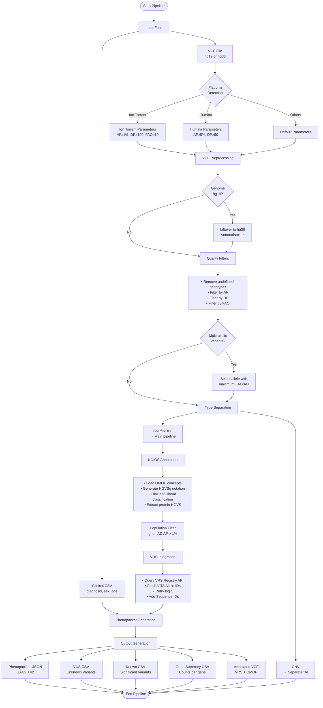
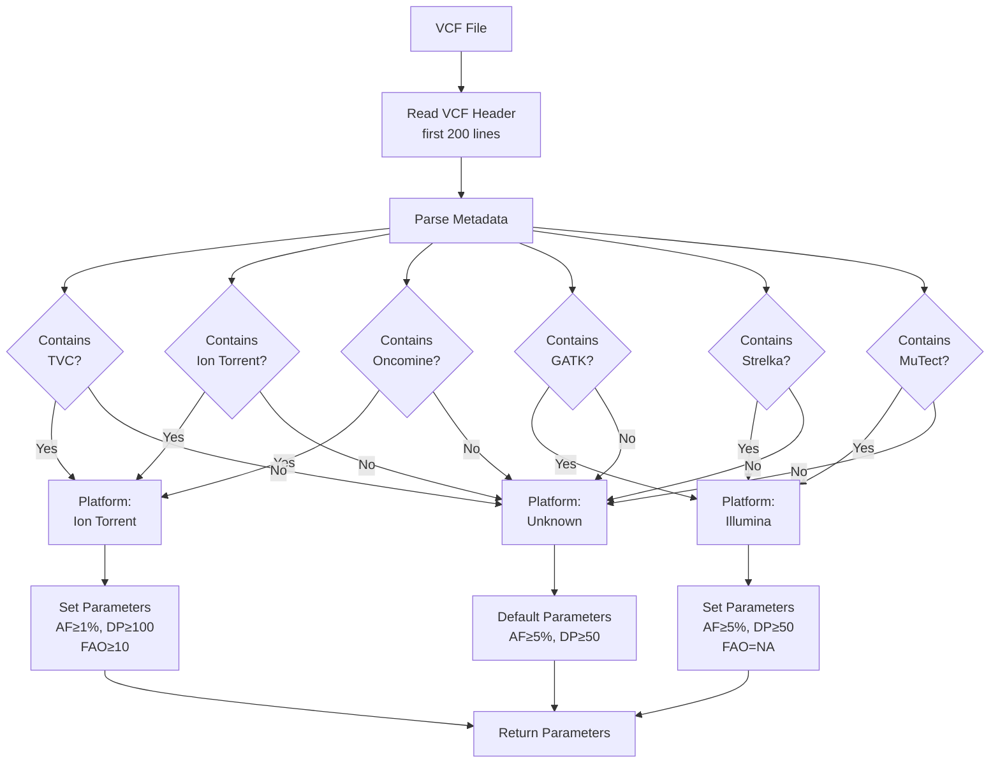
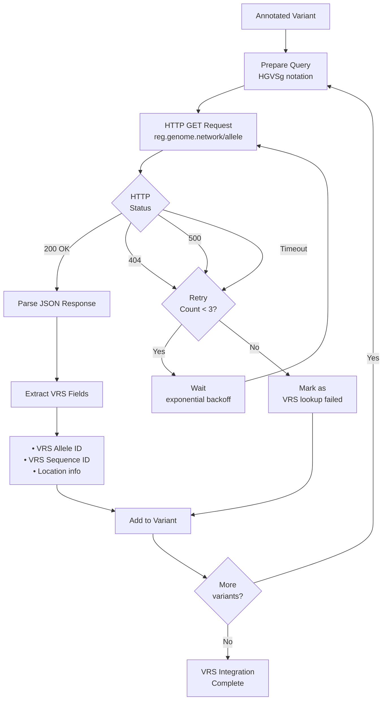
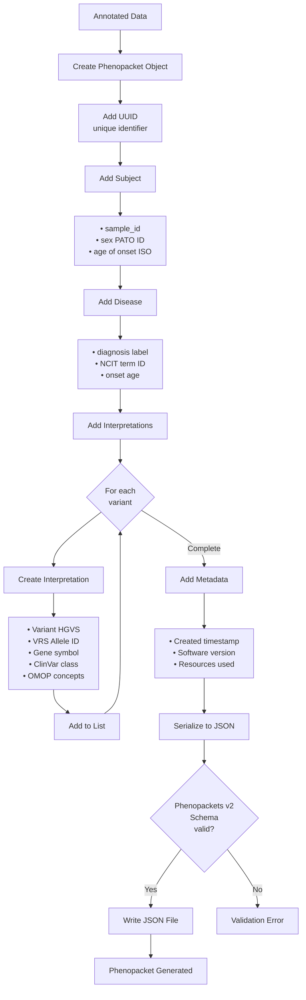
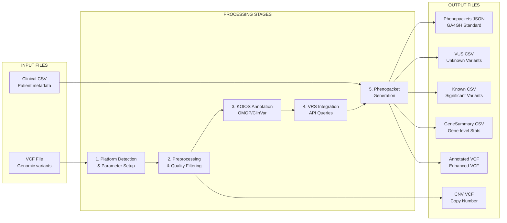
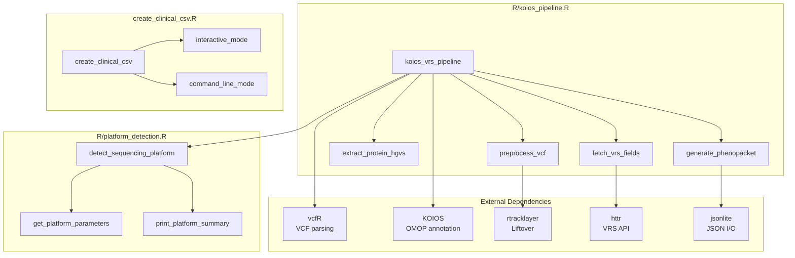
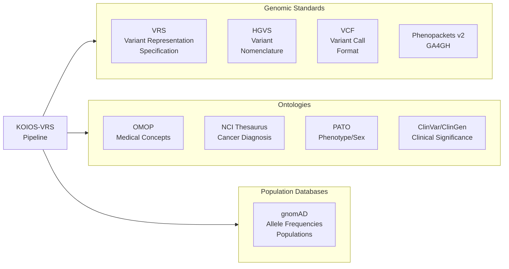

# KOIOS-VRS Pipeline - Flow Diagram

## Main Pipeline Flow

## Platform Detection Detail

## VRS API Query Detail

## Phenopacket Generation Detail

## Data Flow: Input → Output

## Modular Architecture

## Standards and Ontologies Used

---

## Technical Notes

### Main Technologies
- **Language**: R (≥ 4.0)
- **Type**: Bioconductor package
- **API**: VRS Registry (reg.genome.network)
- **Standards**: GA4GH Phenopackets v2, VRS, HGVS

### Supported Platforms
- Ion Torrent (Oncomine panels, TVC caller)
- Illumina (GATK, Strelka, MuTect2, VarScan)
- Other sequencers (default parameters)

### Genome Formats
- **Input**: hg19 or hg38
- **Output**: hg38 (automatic liftover if needed)

### Use Cases
- Cancer genomics (melanoma, lung, colorectal)
- Clinical variant reporting
- OMOP CDM integration
- GA4GH data interoperability

### Output Files

For each pipeline run, the following files are generated:
1. **`*_Phenopackets.json`** - GA4GH Phenopackets v2 format with clinical and genomic data
2. **`*_VUS.csv`** - Variants of Unknown Significance (concept_id = 1028197)
3. **`*_Known.csv`** - Clinically significant variants (known pathogenic/benign)
4. **`*_GeneSummary.csv`** - Gene-level mutation counts and summary statistics
5. **`*_annotated.vcf`** - Final VCF with VRS and OMOP annotations in INFO field
6. **`*_preprocessed.vcf`** - Quality-filtered intermediate VCF (after QC, before annotation)
7. **`*_CNV.vcf`** - Copy number variants (separated from main pipeline)
8. **`*_hg38.vcf`** - Lifted-over VCF (generated only if input was hg19)

---

*Flow diagram for KOIOS-VRS Pipeline v1.0*
*DOI: 10.5281/zenodo.17476991*
