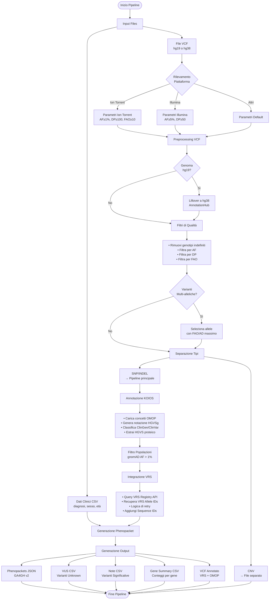
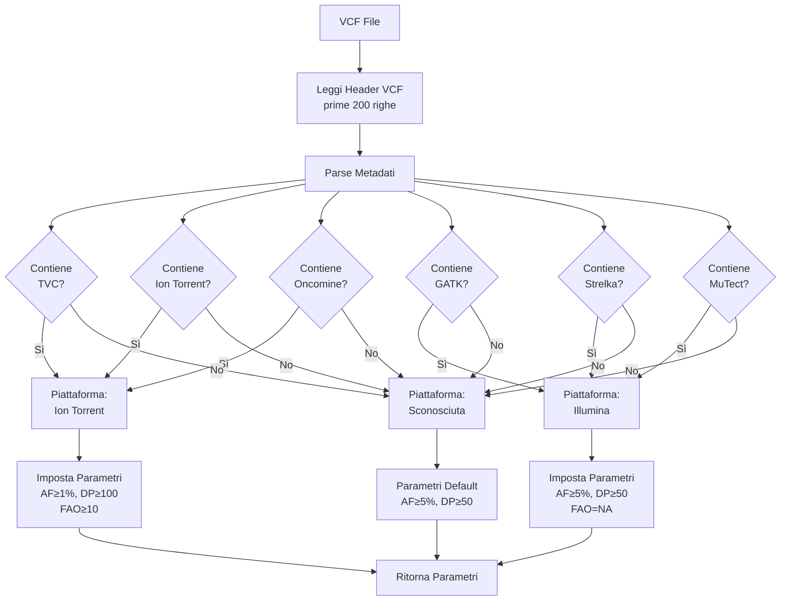
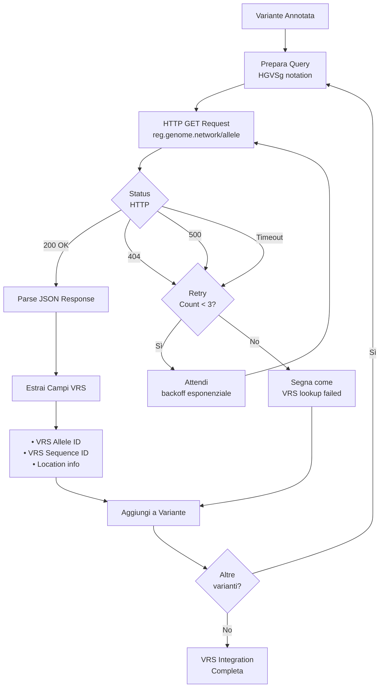
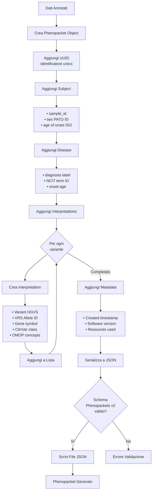
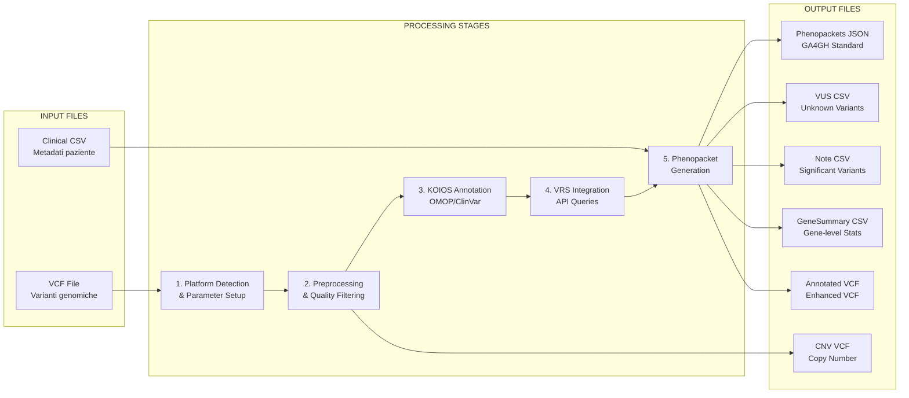
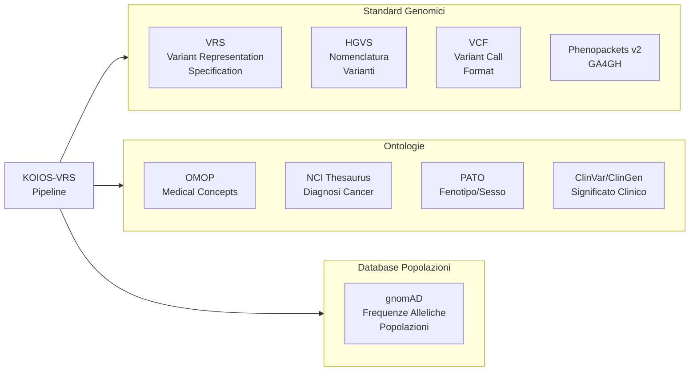

# KOIOS-VRS Pipeline - Diagramma di Flusso

## Panoramica del Flusso Principale

## Dettaglio Rilevamento Piattaforma

## Dettaglio Query VRS API

## Dettaglio Generazione Phenopacket

## Flusso Dati: Input → Output

## Architettura Modulare

## Standard e Ontologie Utilizzate

---

## Note Tecniche

### Tecnologie Principali
- **Linguaggio**: R (≥ 4.0)
- **Tipo**: Pacchetto Bioconductor
- **API**: VRS Registry (reg.genome.network)
- **Standard**: GA4GH Phenopackets v2, VRS, HGVS

### Piattaforme Supportate
- Ion Torrent (Oncomine panels, TVC caller)
- Illumina (GATK, Strelka, MuTect2, VarScan)
- Altri sequenziatori (parametri default)

### Formati Genoma
- **Input**: hg19 o hg38
- **Output**: hg38 (liftover automatico se necessario)

### Casi d'Uso
- Genomica del cancro (melanoma, polmone, colon-retto)
- Reporting clinico varianti
- Integrazione OMOP CDM
- Interoperabilità dati GA4GH

---

*Diagramma generato per KOIOS-VRS Pipeline v1.0*
*DOI: 10.5281/zenodo.17476991*
